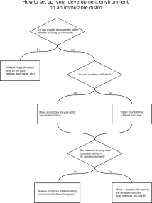

I started using Fedora Silverblue recently and I had stumbled upon a roadblock while using my setup, more of a dilemma than a real problem, so last week I posted a question basically asking what is the best way to do programming on an immutable OS.

Now I come back to wrap up this discussion (or even spur new ideas I didn't think of) that I feel needs to be highlighted for others who might find it useful, maybe because they are facing those same questions, or because they have been holding off from taking the plunge into immutable OSes thinking that they would just make everything more complicated than it needs to be.

About that last point it is kind of true, but it largely depends how you go about doing the things you want to do, sometimes, like in the case of programming you may find that in the end all the preparatory work saves you from other headaches down the line, such as:

- cluttered home directory
- system upgrades not working unless done from the command line
- others (?)

So, onto that, here I try to present in a structured form the various approaches I tried so you can evaluate yourself what works best for you.

<!-- TOC -->

- [Why Distrobox instead of Toolbox?](#why-distrobox-instead-of-toolbox)
- [Decoupling or not?](#decoupling-or-not)
    - [Easy life: all together](#easy-life-all-together)
    - [Needlessly complicated: decoupled](#needlessly-complicated-decoupled)
        - [Flatpak: VSCodium](#flatpak-vscodium)
            - [LSP etc.](#lsp-etc)
            - [Accessing the right terminal](#accessing-the-right-terminal)
        - [Distrobox](#distrobox)
            - [VSCodium](#vscodium)
- [Environment compartmentalization](#environment-compartmentalization)
    - [A distrobox for each language](#a-distrobox-for-each-language)
    - [One distrobox for all languages](#one-distrobox-for-all-languages)
- [Summary in a flow chart](#summary-in-a-flow-chart)

<!-- /TOC -->

# Why Distrobox instead of Toolbox?
Because in this way I'm able to set a separate home directory for the development environment, that keeps all the "junk" that I don't care about in normal usage away from my actual home.

# Decoupling or not?
Should you be decoupling the environment where you actually build with the language from that where you do the editing?

## Easy life: all together
One distrobox for everything: here you will install all the editors and toolchains as usual, nothing changes from a normal installation, so you're already done.

## Needlessly complicated: decoupled
But I like over engineering <sub>sweating as I already know I'll eventually fall back to the previous option</sub>

So now another question: Flatpak or not?

### Flatpak: VSCodium
There are several code editors and IDEs packaged as Flatpak, here I talk about VSCodium which is the one I use

#### LSP etc.
In order to support most languages you will have to install sdk extensions (searchable with `flatpak search Sdk.Extension --columns="application"`), example for Rust and Vala:

- `org.freedesktop.Sdk.Extension.rust-stable`
- `org.freedesktop.Sdk.Extension.vala` 

and add them to the `FLATPAK_ENABLE_SDK_EXT` environment variable to let VSCodium access them:
```
FLATPAK_ENABLE_SDK_EXT=rust-stable,vala
```
this can be done in either of two ways:

1. create a `.desktop` file like so:
```
$ cp /var/lib/flatpak/app/com.vscodium.codium/current/active/export/share/applications/com.vscodium.codium.desktop $HOME/.local/share/applications/
```
edit the `Exec` field in the copied file to add the variable:
```
Exec=/usr/bin/flatpak override --user --env=FLATPAK_ENABLE_SDK_EXT=rust-stable,vala run --branch=stable --arch=x86_64 --command=/app/bin/codium --file-forwarding com.vscodium.codium --unity-launch @@ %F @@
```

2. with Flatseal
```
VSCodium > Environment > +
```
and add the variable

#### Accessing the right terminal
By default opening a terminal will just get you the shell contained in the sandbox, that one doesn't come with the tools we use, therefore we add these configurations to access our **working** distrobox:
- in `settings.json` assuming there is only one box called "dev-env":
```json
	"terminal.integrated.profiles.linux": {
		"dev-env": {
			"path": "/usr/bin/env",
			"args": [
				"--",
				"flatpak-spawn",
				"--host",
				"distrobox",
				"enter",
				"dev-env"
			]
		}
	},
	
	"terminal.integrated.automationProfile.linux": {
		"path": "/usr/bin/env",
		"args": [
			"--",
			"flatpak-spawn",
			"--host",
			"distrobox",
			"enter",
			"dev-env",
			"--"
		]
	}
```
- in `tasks.json` tasks will follow this structure (example for `rustc`):
```json
{
	"label": "[Rust | rustc] Compile and run",
	"type": "shell",
	"command": "bash", // <--
	"args": [
		"-l",          // <--
		"-c",          // <--
		"\"rustc",
		"${relativeFile}",
		"-o",
		"./${relativeFileDirname}/${fileBasenameNoExtension}",
		"&&",
		"./${relativeFileDirname}/${fileBasenameNoExtension}\""
	],
	"group": {
		"kind": "build",
		"isDefault": true,
	},
	"options": {
		"shell": {
			"executable": "/usr/bin/env" // <--
		}
	}
}
```
instead of:
```json
{
	"label": "[Rust | rustc] Compile and run",
	"type": "shell",
	"command": "rustc",
	"args": [
		"${relativeFile}",
		"-o",
		"./${relativeFileDirname}/${fileBasenameNoExtension}",
		"&&",
		"./${relativeFileDirname}/${fileBasenameNoExtension}"
	],
	"group": {
		"kind": "build",
		"isDefault": true,
	}
}
```

### Distrobox
This one has the advantage that managing all the tools just means installing your normal distro packages, you won't need to install `gcc` for example, instead you'll just install `clang-tools-extra` (for `clangd`), `glibc-devel` and `glibc-headers`

#### VSCodium
Here we need to escape the "sandbox" as well, so the configuration will be as follows:
- in `settings.json`:
```json
	"terminal.integrated.profiles.linux": {
		"dev-env": {
			"path": "/usr/bin/env",
			"args": [
				"--",
				"distrobox-host-exec",
				"distrobox",
				"enter",
				"dev-env"
			]
		}
	},
	
	"terminal.integrated.automationProfile.linux": {
		"path": "/usr/bin/env",
		"args": [
			"--",
			"distrobox-host-exec",
			"distrobox",
			"enter",
			"dev-env",
			"--"
		]
	}
```

# Environment compartmentalization
Is it useful to divide all environments in their own bubble?

## A distrobox for each language
I went down this path, but as I went I started seeing the drawbacks to that: 
- storage: when some kinds of projects end up needing multiple toolchains from different languages you end up with duplicate packages all over, defeating, at least in part, the purpose of compartmentalization, wasting a non negligible amount of disk space, that may or may not be an issue for you of course, it depends on how much storage you have.
- configuration: by having multiple boxes you need to make configurations specific for all those, that boils down to copying and pasting files around and then editing them to adapt them, it's not very difficult per se, but it does feels like a useless waste of time.

## One distrobox for all languages
Everything is in one place.  
You need gcc here, but also there?  
No problem, you already installed it.  
You need to escape from the editor sandbox and go into the environment?  
No problem, you just need to edit one file.


# Summary in a flow chart
